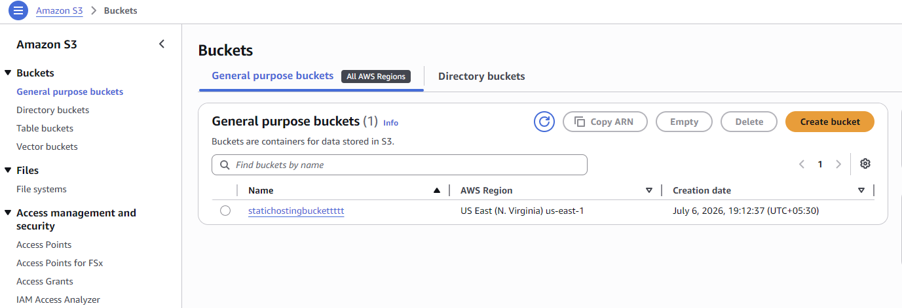
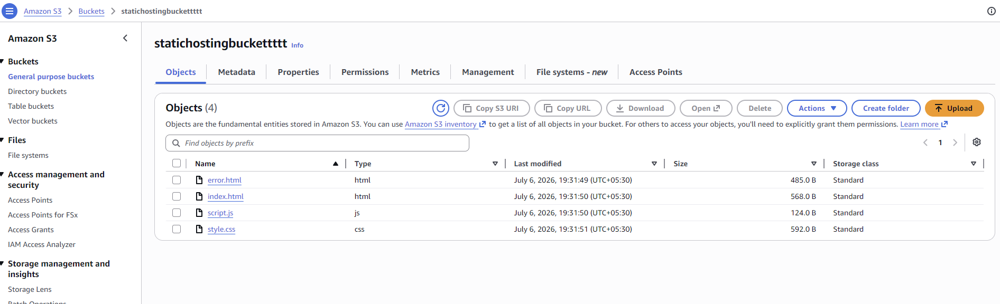
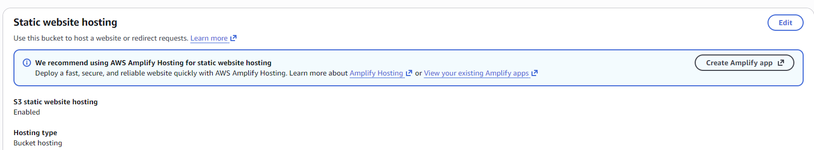
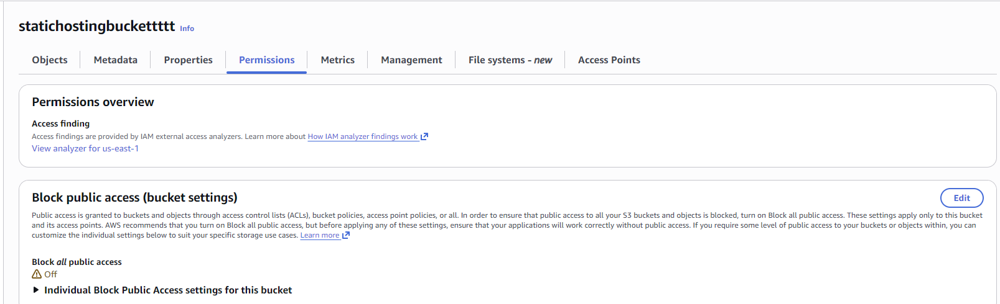
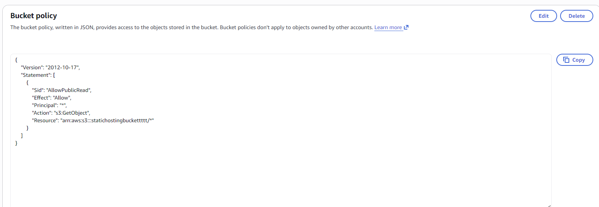
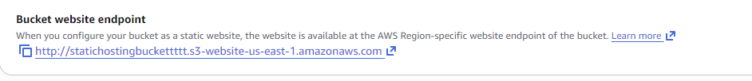
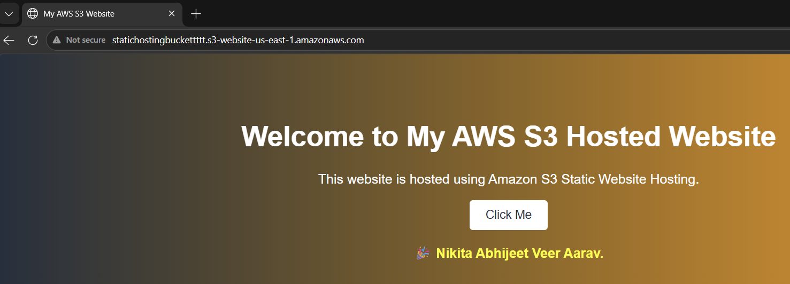

# Project 1 – Static Website Hosting on Amazon S3

Host a static HTML, CSS, and JavaScript website using Amazon S3. This project demonstrates how to configure an S3 bucket for static website hosting, enable public access, and deploy a website without using a web server.

---

## Project Overview

This project uses Amazon S3 to host a static website. The website consists of HTML, CSS, and JavaScript files that are stored in an S3 bucket and served through the S3 Static Website Hosting feature.

### AWS Services Used

- Amazon S3

---

## Architecture

```
                 Internet
                     │
                     ▼
        Amazon S3 Static Website Hosting
                     │
                     ▼
        HTML | CSS | JavaScript Files
```

---

## Project Structure

```
Static-Website-Hosting-S3/
│
├── index.html
├── style.css
├── script.js
├── error.html
└── README.md
```

---

## Prerequisites

- AWS Account
- Basic knowledge of HTML and CSS
- Static website files

---

## Step 1 – Create an S3 Bucket

1. Sign in to the AWS Management Console.
2. Open **Amazon S3**.
3. Click **Create bucket**.
4. Enter a globally unique bucket name.
5. Choose an AWS Region.
6. Keep **Bucket type** as **General purpose**.
7. Click **Create bucket**.
   


---

## Step 2 – Upload Website Files

Upload the following files to the root of the bucket.

```
index.html
style.css
script.js
error.html
```


---

## Step 3 – Enable Static Website Hosting

Navigate to:

```
S3 Bucket
→ Properties
→ Static website hosting
→ Edit
```

Configure:

| Setting | Value |
|---------|-------|
| Static Website Hosting | Enable |
| Hosting Type | Host a static website |
| Index Document | index.html |
| Error Document | error.html |



Save the changes.

---

## Step 4 – Configure Public Access

### Disable Block Public Access

Navigate to:

```
Permissions
→ Block public access
→ Edit
```


Disable all Block Public Access settings and save.

### Bucket Policy

Replace `YOUR_BUCKET_NAME` with your bucket name.

```json
{
  "Version": "2012-10-17",
  "Statement": [
    {
      "Sid": "AllowPublicRead",
      "Effect": "Allow",
      "Principal": "*",
      "Action": "s3:GetObject",
      "Resource": "arn:aws:s3:::YOUR_BUCKET_NAME/*"
    }
  ]
}
```


Save the bucket policy.

---

## Step 5 – Access the Website

Navigate to:

```
Properties
→ Static website hosting
```

Copy the **Bucket website endpoint**.




```
http://statichostingbuckettttt.s3-website-us-east-1.amazonaws.com/

```

Open the URL in a browser.

---

## Expected Output

The website displays:

```
Welcome to My AWS S3 Hosted Website

This website is hosted using Amazon S3 Static Website Hosting.

[ Click Me ]

Nikita Abhijeet Veer Aarav.
```
