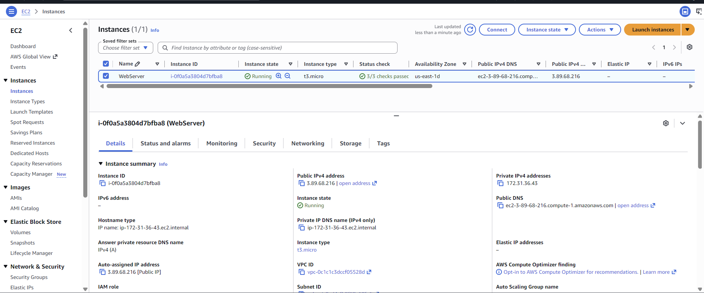
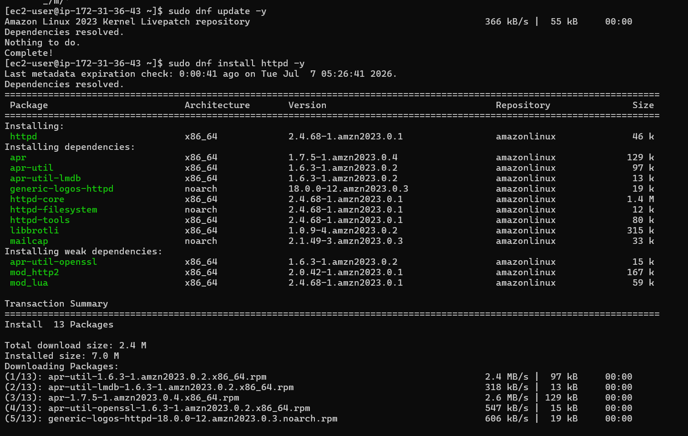
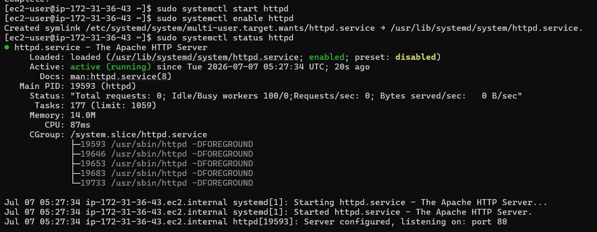
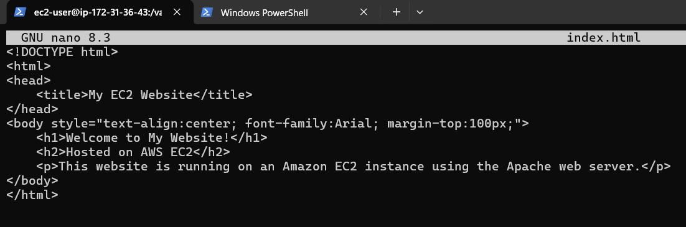
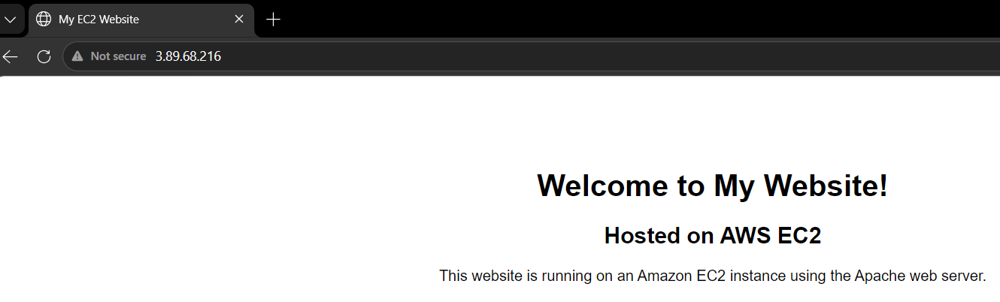

# Project 2 – Host a Website on AWS EC2

## Objective

Host a static website on an Amazon EC2 instance using the Apache web server.

## Prerequisites

- AWS Account
- Amazon EC2 instance (Amazon Linux 2023)
- Security Group configured for SSH and HTTP
- SSH key pair (.pem)
- Terminal or PowerShell

---

## Architecture

```
Internet
    │
    ▼
+-------------------------+
|   Amazon EC2 Instance   |
|-------------------------|
| Amazon Linux 2023       |
| Apache (httpd)          |
| Static Website          |
+-------------------------+
```

---

## Step 1: Launch an EC2 Instance

1. Open the AWS Management Console.
2. Navigate to **EC2**.
3. Click **Launch Instance**.
4. Configure:
   - Name: `WebServer`
   - AMI: Amazon Linux 2023
   - Instance Type: `t2.micro`
   - Create or select a key pair.
5. Configure the Security Group:
   - SSH (Port 22) → My IP
   - HTTP (Port 80) → Anywhere
6. Launch the instance.


---

## Step 2: Connect to the EC2 Instance

Using PowerShell:

```powershell
ssh -i .\webserver1.pem ec2-user@<PUBLIC_IP>
```

Example:

```powershell
ssh -i .\webserver1.pem ec2-user@3.89.68.216
```

Successful login:

```
[ec2-user@ip-172-31-xx-xx ~]$
```


---

## Step 3: Install Apache

Update the system:

```bash
sudo dnf update -y
```


Install Apache:

```bash
sudo dnf install httpd -y
```

Start Apache:

```bash
sudo systemctl start httpd
```

Enable Apache at boot:

```bash
sudo systemctl enable httpd
```

Verify Apache is running:

```bash
sudo systemctl status httpd
```

---

## Step 4: Deploy the Website

Move to the web directory:

```bash
cd /var/www/html
```

Create the home page:

```bash
sudo nano index.html
```

Paste the following HTML:

```html
<!DOCTYPE html>
<html>
<head>
    <title>My EC2 Website</title>
</head>
<body style="text-align:center; font-family:Arial; margin-top:100px;">
    <h1>Welcome to My Website!</h1>
    <h2>Hosted on AWS EC2</h2>
    <p>This website is running on an Amazon EC2 instance using the Apache web server.</p>
</body>
</html>
```


Save the file and restart Apache:

```bash
sudo systemctl restart httpd
```

---

## Step 5: Access the Website

Open a browser and visit:

```
http://<PUBLIC_IP>
```

Example:

```
http://3.89.68.216
```


---

## Project Structure

```
Host-Website-on-EC2/
│
├── README.md
├── index.html
└── screenshots/
    ├── ec2-instance.png
    ├── security-group.png
    ├── apache-running.png
    ├── ssh-connection.png
    └── website-output.png
```

---

## Commands Used

```bash
sudo dnf update -y
sudo dnf install httpd -y
sudo systemctl start httpd
sudo systemctl enable httpd
sudo systemctl status httpd

cd /var/www/html
sudo nano index.html

sudo systemctl restart httpd
```

---

## Expected Output

The website should display:

```
Welcome to My Website!
Hosted on AWS EC2
This website is running on an Amazon EC2 instance using the Apache web server.
```

---

## Technologies Used

- AWS EC2
- Amazon Linux 2023
- Apache HTTP Server
- HTML5
- SSH
- PowerShell

---

## Learning Outcomes

- Launched an EC2 instance.
- Connected securely using SSH.
- Installed and configured Apache.
- Hosted a static website.
- Configured AWS Security Groups.
- Accessed the website through the EC2 public IP.