# AWS Project 3 – Docker on EC2

## Project Overview

This project demonstrates how to install Docker on an Amazon EC2 instance running Amazon Linux 2023 and deploy a containerized Nginx web server. It covers Docker installation, image management, container lifecycle, networking, volumes, and basic Docker administration on AWS.

---

## Architecture

```text
                 Internet
                     │
             HTTP (Port 80)
                     │
             AWS Security Group
            Ports: 22 (SSH), 80 (HTTP)
                     │
                Amazon EC2
           Amazon Linux 2023
                     │
                 Docker Engine
                     │
              Nginx Container
```

---

## AWS Services Used

- Amazon EC2
- Amazon VPC
- Security Groups
- Key Pair (.pem)

---

## Technologies Used

- Docker
- Nginx
- Linux (Amazon Linux 2023)
- SSH
- Docker Hub

---

## Prerequisites

- AWS Account
- EC2 Key Pair
- PowerShell or Terminal
- SSH Client
- Internet Connection

---

# Step 1 – Launch EC2 Instance

Launch an EC2 instance using the following configuration.

| Setting | Value |
|----------|-------|
| Name | Docker-Server |
| AMI | Amazon Linux 2023 |
| Instance Type | t2.micro |
| Security Group | SSH (22), HTTP (80) |
| Key Pair | Existing or New |

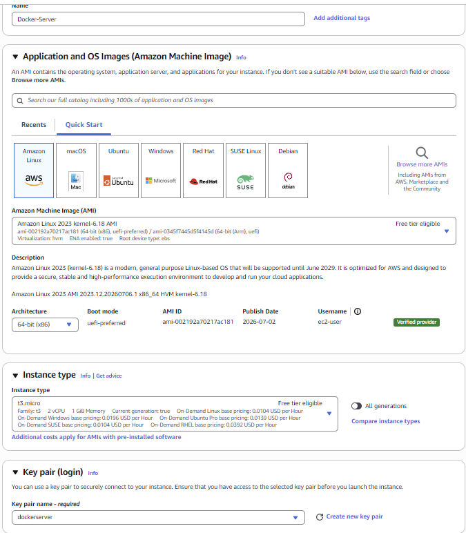
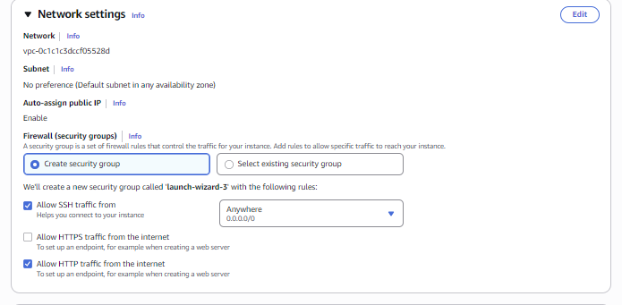

---

# Step 2 – Connect to EC2

```bash
ssh -i "dockerserver.pem" ec2-user@<PUBLIC-IP>
```

Example

```bash
ssh -i "dockerserver.pem" ec2-user@44.xxx.xxx.xxx
```
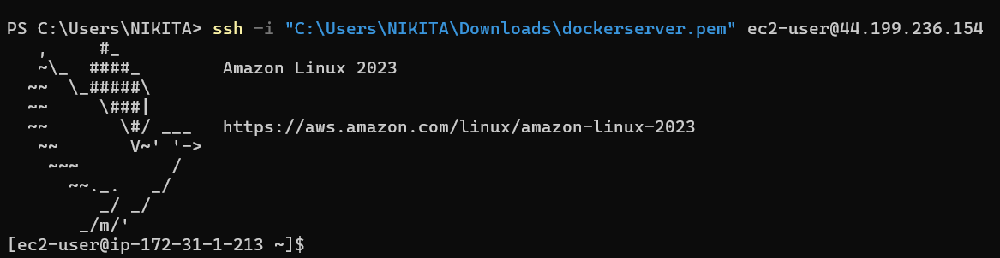

---

# Step 3 – Update the Server

```bash
sudo dnf update -y
```

Verify OS

```bash
cat /etc/os-release
```
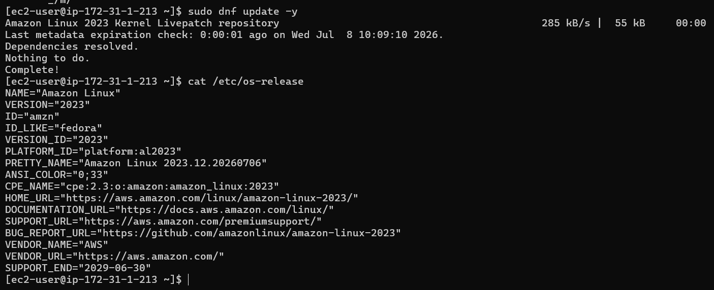

---

# Step 4 – Install Docker

Install Docker

```bash
sudo dnf install docker -y
```
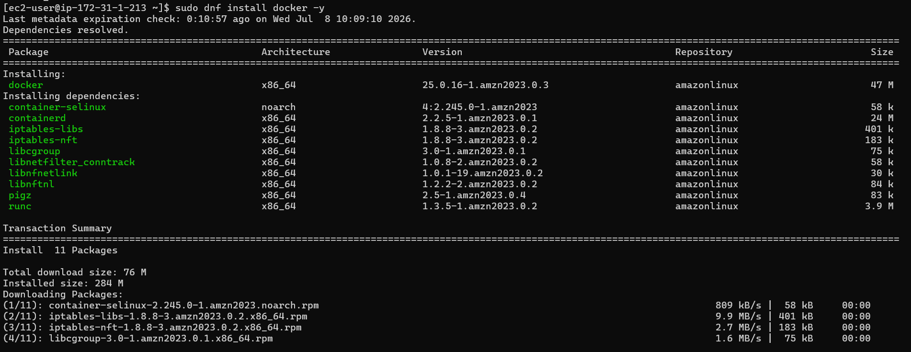

Start Docker

```bash
sudo systemctl start docker
```

Enable Docker at Boot

```bash
sudo systemctl enable docker
```

Verify Status

```bash
sudo systemctl status docker
```
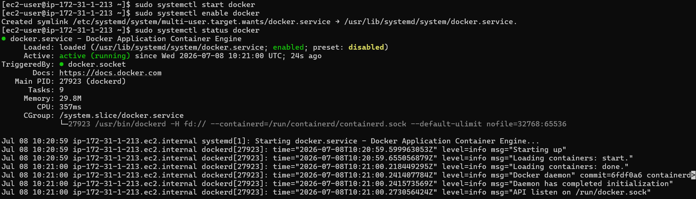
---

# Step 5 – Verify Docker Installation

```bash
docker --version
```

Example Output

```text
Docker version 28.x.x
```


---

# Step 6 – Allow Docker Without sudo

Add the EC2 user to the Docker group.

```bash
sudo usermod -aG docker ec2-user
```

Refresh Group Membership

```bash
newgrp docker
```

Verify

```bash
docker ps
```
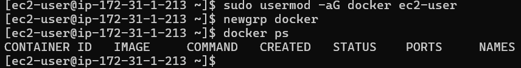

---

# Step 7 – Test Docker

Run the Hello World container.

```bash
docker run hello-world
```

Successful Output

```text
Hello from Docker!
This message shows that your installation appears to be working correctly.
```

View Containers

```bash
docker ps -a
```
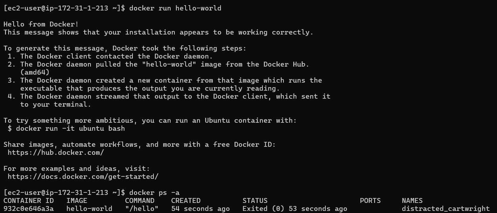

---

# Step 8 – Download Nginx Image

Pull the latest Nginx image.

```bash
docker pull nginx
```

Verify Images

```bash
docker images
```
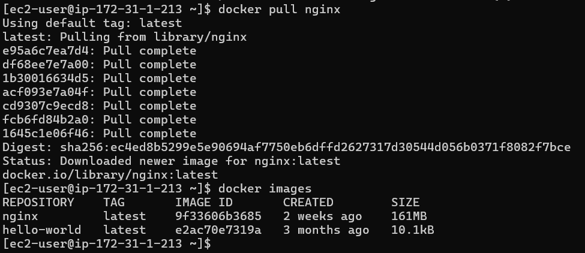

---

# Step 9 – Run Nginx Container

Create and run a container.

```bash
docker run -d --name nginx-container -p 80:80 nginx
```

Verify Running Container

```bash
docker ps
```
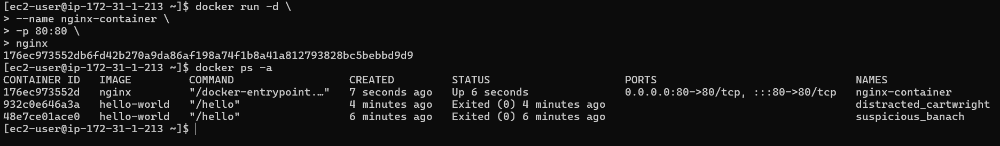

---

# Step 10 – Access Nginx

Open your browser.

```text
http://<EC2-PUBLIC-IP>
```

Example

```text
http://44.xxx.xxx.xxx
```

Expected Page

```
Welcome to nginx!
```
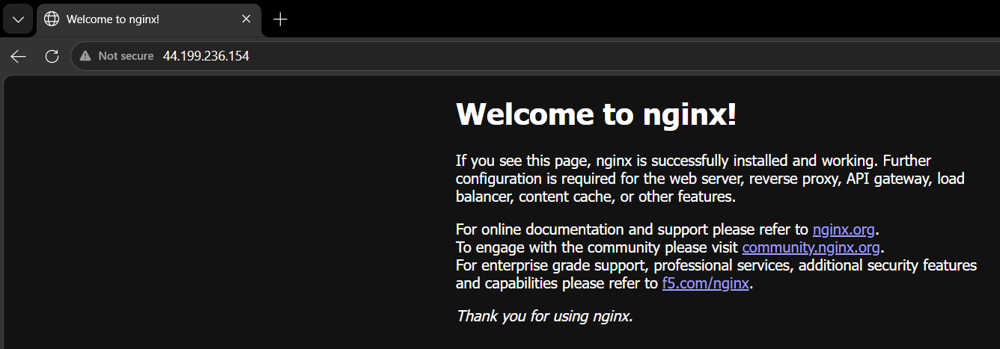